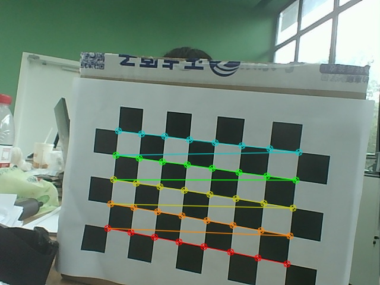

# python+openmv 深度信息采集

hbv-1760-2 s2.0
 ***
## 1.相机标定
 1.1 使用标定棋盘格为9*6  故参数为  a=8\*b=5

1.2 用 camcapture.py 对双目摄像头进行拍照并实时获得标定信息
**得到如图信息**

---
## 2.深度信息获取
1.1 运行 SaveImage2/main_stereo_vision...py 
1.2 双击运行图像得到深度

tips:opencv做的深度识别不是太准，帧率也不太高，应该是获得相机参数的问题，下一步考虑用matlab计算相机准确参数

**照片一定要自己的相机找出来才有用！！！
照片一定要自己的相机找出来才有用！！！
照片一定要自己的相机找出来才有用！！！**
